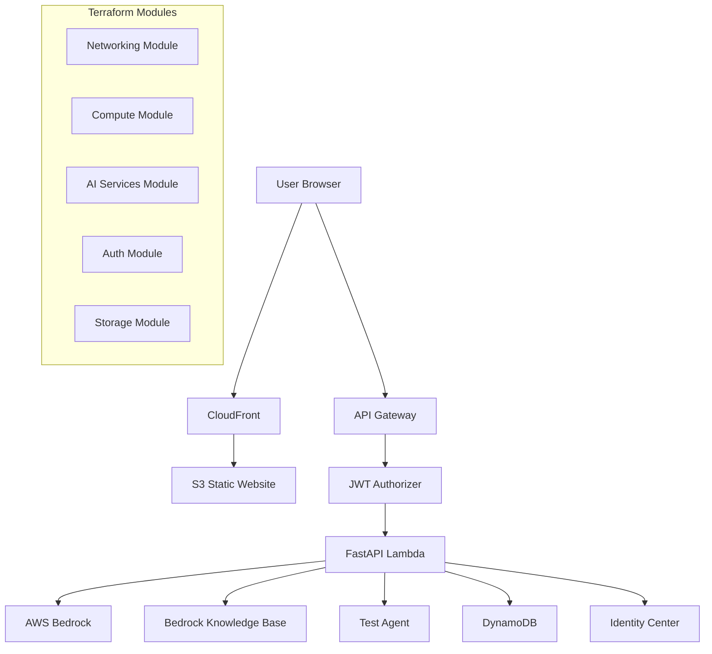

# Design Document

## Overview

The AI Assistant CLI is a web-based application that provides a terminal-like interface for interacting with AI models and agents through AWS services. The system leverages AWS Bedrock for AI capabilities, AWS Identity Center for authentication, and includes RAG functionality through Bedrock Knowledge Bases. The architecture follows a modern serverless approach with real-time communication capabilities.

## Architecture

### High-Level Architecture



### Component Architecture

The system is designed with the following key components:

1. **Frontend**: React-based web application with terminal-like interface
2. **Backend**: FastAPI application running on AWS Lambda
3. **Authentication**: AWS Identity Center with JWT validation
4. **AI Services**: AWS Bedrock with Nova Pro model and Knowledge Bases
5. **Agent Integration**: Test agent built with strands-agents SDK
6. **Infrastructure**: Modular Terraform using AWSCC provider

## Components and Interfaces

### Frontend Component

**Technology Stack:**
- React with TypeScript
- xterm.js for terminal emulation
- WebSocket client for real-time communication
- Tailwind CSS for styling

**Key Features:**
- Terminal-like interface with command history
- Real-time streaming of AI responses
- Knowledge base selection dropdown
- Session management
- Auto-reconnection on WebSocket failures

**Interface Contracts:**
```typescript
interface WebSocketMessage {
  type: 'command' | 'response' | 'error' | 'status';
  content: string;
  sessionId: string;
  knowledgeBaseId?: string;
  timestamp: string;
}

interface KnowledgeBase {
  id: string;
  name: string;
  description: string;
  status: 'ACTIVE' | 'INACTIVE';
}
```

### Backend API Component

**Technology Stack:**
- FastAPI with Python 3.11
- AWS Lambda for serverless execution
- WebSocket support through API Gateway
- Boto3 for AWS service integration

**Core Services:**

1. **Authentication Service**
   - JWT token validation
   - User session management
   - Identity Center integration

2. **AI Service**
   - Bedrock Nova Pro model integration
   - Streaming response handling
   - Error handling and fallbacks

3. **Knowledge Base Service**
   - Discovery of available knowledge bases
   - RAG query processing
   - RetrieveAndGenerate API integration

4. **Agent Service**
   - Test agent integration
   - strands-agents SDK wrapper
   - Birmingham, AL data retrieval

5. **Session Service**
   - DynamoDB session storage
   - Conversation history management
   - Session cleanup and archival

**API Endpoints:**
```python
# REST Endpoints
GET /api/v1/knowledge-bases
GET /api/v1/sessions/{session_id}
POST /api/v1/sessions
DELETE /api/v1/sessions/{session_id}

# WebSocket Endpoints
/ws/chat/{session_id}
```

### Authentication Component

**AWS Identity Center Integration:**
- OIDC/OAuth2 flow implementation
- JWT token validation in API Gateway
- User context propagation to backend

**Security Flow:**
1. User accesses application → Redirect to Identity Center
2. Successful authentication → JWT token issued
3. Frontend stores token → Includes in API requests
4. API Gateway validates token → Forwards to Lambda with user context

### AI Services Component

**Bedrock Integration:**
- Nova Pro model for general AI interactions
- Streaming response support
- Error handling and retry logic

**Knowledge Base Integration:**
- Dynamic discovery of available knowledge bases
- RetrieveAndGenerate API for RAG queries
- Context-aware response generation

**Agent Integration:**
- Test agent deployment with strands-agents SDK
- Birmingham, AL time/date/weather data
- Structured response formatting

### Infrastructure Component

**Modular Terraform Structure:**
```
terraform/
├── modules/
│   ├── networking/
│   ├── compute/
│   ├── ai-services/
│   ├── auth/
│   └── storage/
├── environments/
│   ├── dev/
│   ├── staging/
│   └── prod/
└── main.tf
```

**AWSCC Provider Benefits:**
- Better support for Bedrock services
- Faster updates for new AWS features
- Improved resource lifecycle management

## Data Models

### Session Model
```python
@dataclass
class Session:
    session_id: str
    user_id: str
    created_at: datetime
    last_activity: datetime
    knowledge_base_id: Optional[str]
    conversation_history: List[Message]
    status: SessionStatus
```

### Message Model
```python
@dataclass
class Message:
    message_id: str
    session_id: str
    content: str
    message_type: MessageType  # USER, ASSISTANT, AGENT, SYSTEM
    timestamp: datetime
    metadata: Dict[str, Any]
```

### Knowledge Base Model
```python
@dataclass
class KnowledgeBase:
    knowledge_base_id: str
    name: str
    description: str
    status: str
    created_date: datetime
    updated_date: datetime
```

### Agent Response Model
```python
@dataclass
class AgentResponse:
    agent_id: str
    response_type: str  # TIME, DATE, WEATHER
    data: Dict[str, Any]
    location: str = "Birmingham, Alabama"
    timestamp: datetime
```

## Error Handling

### Frontend Error Handling
- WebSocket connection failures with auto-retry
- API request timeouts with user feedback
- Authentication errors with redirect to login
- Network connectivity issues with offline indicators

### Backend Error Handling
- Bedrock service unavailability with fallback responses
- Knowledge base query failures with graceful degradation
- Agent communication errors with detailed error messages
- DynamoDB failures with retry logic and circuit breakers

### Error Response Format
```python
@dataclass
class ErrorResponse:
    error_code: str
    error_message: str
    details: Optional[Dict[str, Any]]
    timestamp: datetime
    request_id: str
```

## Testing Strategy

### Unit Testing
- FastAPI endpoint testing with pytest
- Frontend component testing with Jest/React Testing Library
- Terraform module validation with terratest
- Agent functionality testing with strands-agents test framework

### Integration Testing
- End-to-end WebSocket communication testing
- AWS service integration testing with moto/localstack
- Authentication flow testing with mock Identity Center
- Knowledge base query testing with sample data

### Performance Testing
- WebSocket connection load testing
- Bedrock API response time testing
- DynamoDB query performance testing
- Frontend rendering performance testing

### Security Testing
- JWT token validation testing
- API authorization testing
- Input sanitization testing
- CORS configuration testing

## Deployment Strategy

### Environment Configuration
- Development: Local development with WSL Ubuntu
- Staging: AWS environment with reduced resources
- Production: Full AWS deployment with monitoring

### CI/CD Pipeline
1. Code commit triggers pipeline
2. Unit and integration tests
3. Terraform plan and validation
4. Staging deployment and testing
5. Production deployment approval
6. Post-deployment verification

### Monitoring and Observability
- CloudWatch logs for all components
- X-Ray tracing for request flows
- Custom metrics for AI service usage
- Health checks for all endpoints

## Security Considerations

### Authentication and Authorization
- JWT token validation at API Gateway
- User context propagation to all services
- Session timeout and refresh handling
- Role-based access control for knowledge bases

### Data Protection
- Encryption in transit (HTTPS/WSS)
- Encryption at rest (DynamoDB, S3)
- Sensitive data masking in logs
- PII handling compliance

### Network Security
- VPC configuration for Lambda functions
- Security groups and NACLs
- API Gateway throttling and rate limiting
- CORS configuration for frontend

## Performance Considerations

### Scalability
- Lambda auto-scaling for backend
- DynamoDB on-demand scaling
- CloudFront caching for frontend assets
- WebSocket connection pooling

### Optimization
- Bedrock response streaming for better UX
- Knowledge base query caching
- Session data compression
- Frontend code splitting and lazy loading

### Resource Management
- Lambda memory and timeout optimization
- DynamoDB capacity planning
- S3 storage class optimization
- Cost monitoring and alerting