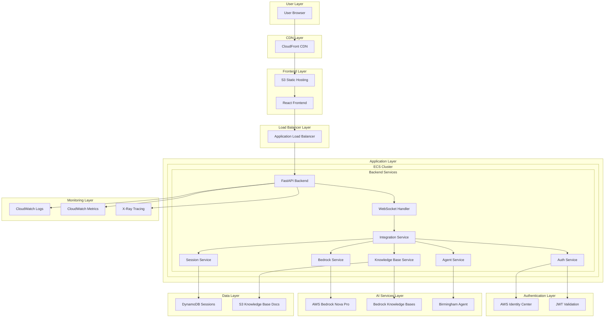
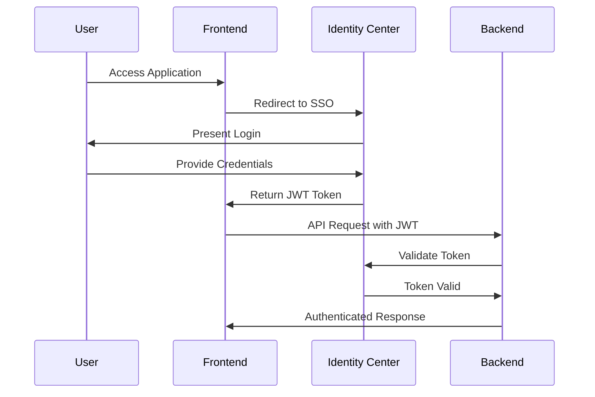
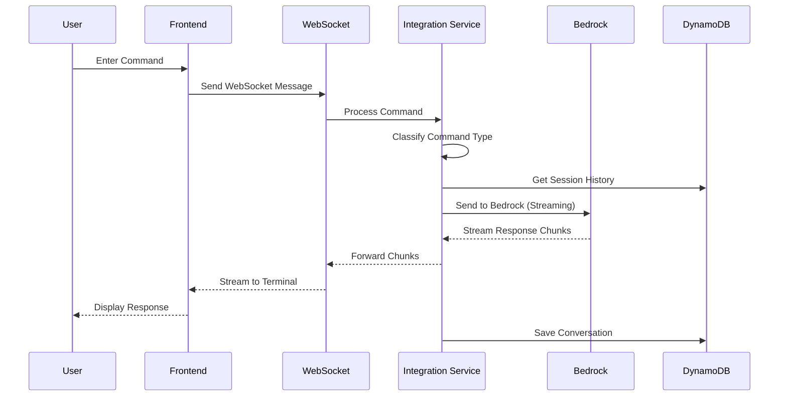
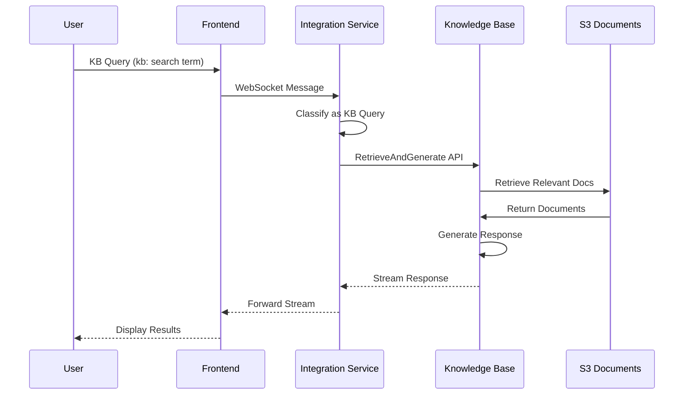
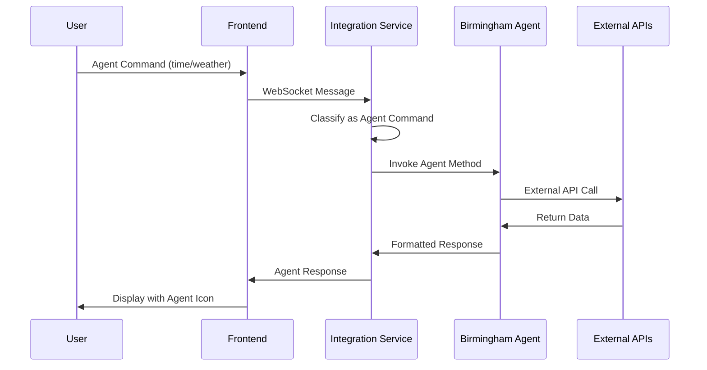

# AI Assistant CLI - Architecture Documentation

This document provides a comprehensive overview of the AI Assistant CLI solution architecture, including AWS services, components, data flow, and design decisions.

## Table of Contents

1. [System Overview](#system-overview)
2. [Architecture Diagram](#architecture-diagram)
3. [Component Architecture](#component-architecture)
4. [AWS Services](#aws-services)
5. [Data Flow](#data-flow)
6. [Security Architecture](#security-architecture)
7. [Scalability and Performance](#scalability-and-performance)
8. [Integration Patterns](#integration-patterns)
9. [Design Decisions](#design-decisions)
10. [Future Considerations](#future-considerations)

## System Overview

The AI Assistant CLI is a web-based terminal interface that provides users with access to AI capabilities through a familiar command-line experience. The system integrates multiple AI services, knowledge bases, and custom agents to deliver comprehensive assistance.

### Key Features
- **Terminal-like Interface**: Familiar CLI experience in a web browser
- **Real-time AI Interactions**: Streaming responses from AWS Bedrock Nova Pro
- **Knowledge Base Integration**: RAG (Retrieval Augmented Generation) capabilities
- **Custom Agent Integration**: Birmingham weather/time agent
- **Session Management**: Persistent conversation history
- **Authentication**: AWS Identity Center integration
- **Multi-tenant Support**: User isolation and access control

### Technology Stack
- **Frontend**: React 18, TypeScript, Vite, Tailwind CSS, xterm.js
- **Backend**: Python 3.12, FastAPI, WebSockets, asyncio
- **Infrastructure**: AWS ECS Fargate, Application Load Balancer
- **Storage**: DynamoDB, S3
- **AI Services**: AWS Bedrock (Nova Pro), Bedrock Knowledge Bases
- **Authentication**: AWS Identity Center (SSO)
- **Monitoring**: CloudWatch Logs and Metrics

## Architecture Diagram



## Component Architecture

### Frontend Components

#### 1. Terminal Interface
```typescript
// Core terminal component using xterm.js
Terminal Component
├── Command Input Handler
├── Output Renderer
├── History Management
├── Streaming Response Handler
└── WebSocket Integration
```

#### 2. WebSocket Client
```typescript
WebSocketClient
├── Connection Management
├── Message Routing
├── Reconnection Logic
├── Error Handling
└── Stream Processing
```

#### 3. Authentication Components
```typescript
Authentication Layer
├── AuthContext (React Context)
├── ProtectedRoute Component
├── Login Component
├── Token Management
└── Session Persistence
```

#### 4. Knowledge Base Components
```typescript
Knowledge Base UI
├── KnowledgeBaseSelector
├── Knowledge Base Service
├── Session Integration
└── Real-time Switching
```

### Backend Components

#### 1. FastAPI Application Structure
```python
FastAPI Backend
├── main.py (Application Entry)
├── routers/
│   ├── health.py
│   ├── sessions.py
│   ├── knowledge_bases.py
│   ├── websocket.py
│   ├── bedrock.py
│   └── agent.py
├── services/
│   ├── integration_service.py
│   ├── auth_service.py
│   ├── session_service.py
│   ├── bedrock_service.py
│   ├── knowledge_base_service.py
│   └── agent_service.py
├── models/
│   ├── session.py
│   ├── message.py
│   ├── knowledge_base.py
│   └── agent_response.py
├── middleware/
│   ├── cors.py
│   ├── logging.py
│   ├── error_handling.py
│   └── integration_error_handling.py
└── config.py
```

#### 2. Integration Service Architecture
```python
Integration Service (Orchestrator)
├── Command Classification
├── Service Routing
├── Response Streaming
├── Error Handling
├── Circuit Breakers
└── Monitoring
```

#### 3. Service Layer Architecture
```python
Service Layer
├── Auth Service (JWT validation, user context)
├── Session Service (DynamoDB operations)
├── Bedrock Service (AI model interactions)
├── Knowledge Base Service (RAG operations)
├── Agent Service (Custom agent integration)
└── Monitoring Service (Metrics and logging)
```

## AWS Services

### Core Infrastructure Services

#### 1. Amazon ECS Fargate
- **Purpose**: Container orchestration for backend services
- **Configuration**: 
  - Cluster: ai-assistant-cli-cluster
  - Service: Auto-scaling based on CPU/memory
  - Task Definition: Python FastAPI container
- **Benefits**: Serverless containers, automatic scaling, managed infrastructure

#### 2. Application Load Balancer (ALB)
- **Purpose**: Load balancing and WebSocket support
- **Configuration**:
  - HTTP/HTTPS listeners
  - WebSocket upgrade support
  - Health checks for ECS targets
  - SSL termination
- **Benefits**: High availability, WebSocket support, SSL offloading

#### 3. Amazon CloudFront
- **Purpose**: Global CDN for frontend assets
- **Configuration**:
  - S3 origin for static assets
  - Custom headers for API requests
  - Caching policies for optimal performance
- **Benefits**: Global distribution, improved performance, DDoS protection

#### 4. Amazon S3
- **Purpose**: Static website hosting and document storage
- **Buckets**:
  - Frontend assets bucket
  - Knowledge base documents bucket
  - Terraform state bucket
- **Benefits**: High durability, cost-effective storage, static hosting

### AI and ML Services

#### 1. Amazon Bedrock
- **Model**: Nova Pro (amazon.nova-pro-v1:0)
- **Purpose**: Primary AI model for general queries
- **Features**:
  - Streaming responses
  - Conversation context
  - Multi-modal capabilities
- **Integration**: Direct API calls via boto3

#### 2. Amazon Bedrock Knowledge Bases
- **Purpose**: RAG (Retrieval Augmented Generation)
- **Components**:
  - Vector database for embeddings
  - Document ingestion pipeline
  - Retrieval and generation API
- **Integration**: RetrieveAndGenerate API with streaming

### Data Services

#### 1. Amazon DynamoDB
- **Purpose**: Session and conversation storage
- **Tables**:
  - ai-assistant-sessions (session metadata)
  - Conversation history embedded in session records
- **Configuration**:
  - On-demand billing
  - Point-in-time recovery
  - Auto-scaling enabled
- **Benefits**: NoSQL flexibility, automatic scaling, low latency

### Authentication Services

#### 1. AWS Identity Center (SSO)
- **Purpose**: User authentication and authorization
- **Configuration**:
  - SAML 2.0 integration
  - Custom application registration
  - User and group management
- **Integration**: JWT token validation in backend

### Monitoring and Logging Services

#### 1. Amazon CloudWatch
- **Logs**: Application logs from ECS containers
- **Metrics**: Custom metrics for application performance
- **Alarms**: Automated alerting for system health
- **Dashboards**: Real-time monitoring visualization

#### 2. AWS X-Ray (Optional)
- **Purpose**: Distributed tracing
- **Benefits**: Request tracing, performance analysis, bottleneck identification

## Data Flow

### 1. User Authentication Flow


### 2. AI Query Processing Flow


### 3. Knowledge Base Query Flow


### 4. Agent Integration Flow


## Security Architecture

### 1. Authentication and Authorization
- **Identity Provider**: AWS Identity Center
- **Token Format**: JWT with custom claims
- **Token Validation**: Backend middleware validation
- **Session Management**: Secure session storage in DynamoDB

### 2. Network Security
- **VPC**: Isolated network environment
- **Security Groups**: Restrictive ingress/egress rules
- **ALB**: SSL termination and security headers
- **CloudFront**: DDoS protection and WAF integration

### 3. Data Security
- **Encryption in Transit**: HTTPS/WSS for all communications
- **Encryption at Rest**: DynamoDB and S3 encryption
- **Secrets Management**: AWS Secrets Manager for sensitive data
- **IAM Roles**: Least privilege access principles

### 4. Application Security
- **Input Validation**: Comprehensive input sanitization
- **CORS Configuration**: Restrictive cross-origin policies
- **Rate Limiting**: Protection against abuse
- **Error Handling**: Secure error messages without information leakage

## Scalability and Performance

### 1. Horizontal Scaling
- **ECS Auto Scaling**: CPU/memory-based scaling
- **ALB**: Distributes load across multiple containers
- **DynamoDB**: On-demand scaling for read/write capacity
- **CloudFront**: Global edge locations for content delivery

### 2. Performance Optimizations
- **Streaming Responses**: Real-time AI response delivery
- **Connection Pooling**: Efficient database connections
- **Caching**: CloudFront and application-level caching
- **Async Processing**: Non-blocking I/O operations

### 3. Resource Management
- **Circuit Breakers**: Prevent cascade failures
- **Connection Limits**: WebSocket connection management
- **Memory Management**: Efficient Python memory usage
- **Container Resources**: Optimized CPU/memory allocation

## Integration Patterns

### 1. Service Integration Pattern
```python
# Integration Service acts as orchestrator
class IntegrationService:
    def __init__(self):
        self.auth_service = AuthService()
        self.session_service = SessionService()
        self.bedrock_service = BedrockService()
        self.kb_service = KnowledgeBaseService()
        self.agent_service = AgentService()
    
    async def process_command(self, command, user_context):
        # Route to appropriate service based on command type
        command_type = self.classify_command(command)
        
        if command_type == "agent":
            return await self.handle_agent_command(command, user_context)
        elif command_type == "knowledge_base":
            return await self.handle_kb_query(command, user_context)
        else:
            return await self.handle_ai_query(command, user_context)
```

### 2. Error Handling Pattern
```python
# Circuit breaker pattern for service resilience
class CircuitBreaker:
    def __init__(self, failure_threshold=5, recovery_timeout=60):
        self.failure_threshold = failure_threshold
        self.recovery_timeout = recovery_timeout
        self.failure_count = 0
        self.state = "CLOSED"  # CLOSED, OPEN, HALF_OPEN
    
    async def call(self, func, *args, **kwargs):
        if self.state == "OPEN":
            if self.should_attempt_reset():
                self.state = "HALF_OPEN"
            else:
                raise CircuitBreakerOpenException()
        
        try:
            result = await func(*args, **kwargs)
            self.on_success()
            return result
        except Exception as e:
            self.on_failure()
            raise
```

### 3. WebSocket Communication Pattern
```typescript
// Frontend WebSocket service with reconnection
class WebSocketService {
    private ws: WebSocket | null = null;
    private reconnectAttempts = 0;
    private maxReconnectAttempts = 5;
    
    async connect(): Promise<void> {
        try {
            this.ws = new WebSocket(this.config.url);
            this.setupEventListeners();
        } catch (error) {
            await this.handleConnectionError();
        }
    }
    
    private async handleConnectionError(): Promise<void> {
        if (this.reconnectAttempts < this.maxReconnectAttempts) {
            this.reconnectAttempts++;
            setTimeout(() => this.connect(), this.reconnectInterval);
        }
    }
}
```

## Design Decisions

### 1. Technology Choices

#### Frontend: React + TypeScript
- **Rationale**: Strong typing, component reusability, large ecosystem
- **Alternatives Considered**: Vue.js, Angular
- **Trade-offs**: Learning curve vs. developer productivity

#### Backend: FastAPI + Python
- **Rationale**: Async support, automatic API documentation, Python AI ecosystem
- **Alternatives Considered**: Node.js, Go, Java Spring Boot
- **Trade-offs**: Performance vs. development speed and AI library support

#### Terminal Interface: xterm.js
- **Rationale**: Full-featured terminal emulation, WebSocket support
- **Alternatives Considered**: Custom terminal implementation
- **Trade-offs**: Bundle size vs. feature completeness

### 2. Architecture Patterns

#### Microservices vs. Modular Monolith
- **Decision**: Modular monolith with service layer separation
- **Rationale**: Simpler deployment, reduced complexity, easier debugging
- **Future Consideration**: Can be split into microservices as system grows

#### Synchronous vs. Asynchronous Processing
- **Decision**: Asynchronous processing with streaming responses
- **Rationale**: Better user experience, efficient resource utilization
- **Implementation**: Python asyncio, WebSocket streaming

#### Session Storage: DynamoDB vs. Redis
- **Decision**: DynamoDB for session storage
- **Rationale**: Managed service, automatic scaling, persistence
- **Trade-offs**: Slightly higher latency vs. operational simplicity

### 3. Security Decisions

#### Authentication: AWS Identity Center vs. Custom Auth
- **Decision**: AWS Identity Center integration
- **Rationale**: Enterprise-grade security, SSO capabilities, AWS integration
- **Trade-offs**: AWS vendor lock-in vs. security and compliance benefits

#### Token Format: JWT vs. Opaque Tokens
- **Decision**: JWT tokens with custom claims
- **Rationale**: Stateless validation, reduced database lookups
- **Security Considerations**: Token expiration, secure signing keys

## Future Considerations

### 1. Scalability Enhancements
- **Microservices Migration**: Split services as system grows
- **Caching Layer**: Redis for session and response caching
- **Database Sharding**: Partition data across multiple DynamoDB tables
- **CDN Optimization**: Advanced caching strategies

### 2. Feature Enhancements
- **Multi-modal Support**: Image and file upload capabilities
- **Plugin System**: Extensible agent architecture
- **Collaboration Features**: Shared sessions and workspaces
- **Advanced Analytics**: User behavior and system performance analytics

### 3. Operational Improvements
- **Blue-Green Deployments**: Zero-downtime deployments
- **Canary Releases**: Gradual feature rollouts
- **Advanced Monitoring**: APM tools, custom metrics
- **Disaster Recovery**: Multi-region deployment

### 4. AI/ML Enhancements
- **Model Fine-tuning**: Custom model training for specific use cases
- **Multi-model Support**: Integration with multiple AI providers
- **Intelligent Routing**: AI-powered command classification
- **Context Awareness**: Enhanced conversation context management

### 5. Security Enhancements
- **Zero Trust Architecture**: Enhanced security model
- **Advanced Threat Detection**: AI-powered security monitoring
- **Data Loss Prevention**: Content filtering and monitoring
- **Compliance Features**: GDPR, HIPAA, SOC2 compliance tools

This architecture provides a solid foundation for the AI Assistant CLI while maintaining flexibility for future enhancements and scaling requirements. The design emphasizes security, performance, and maintainability while leveraging AWS managed services to reduce operational overhead.